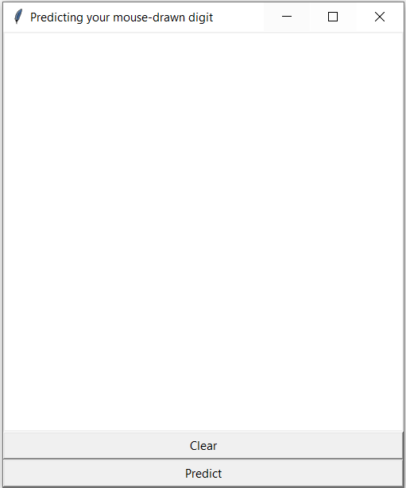
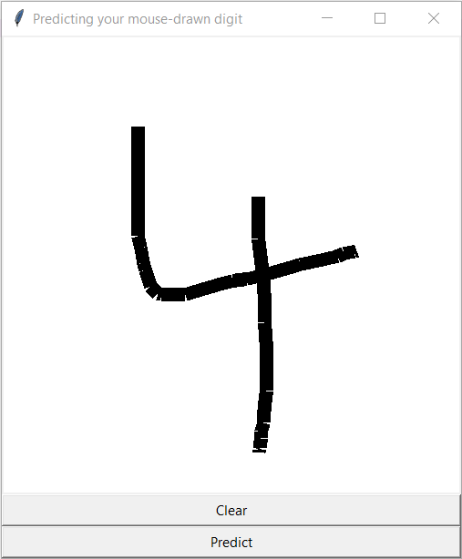
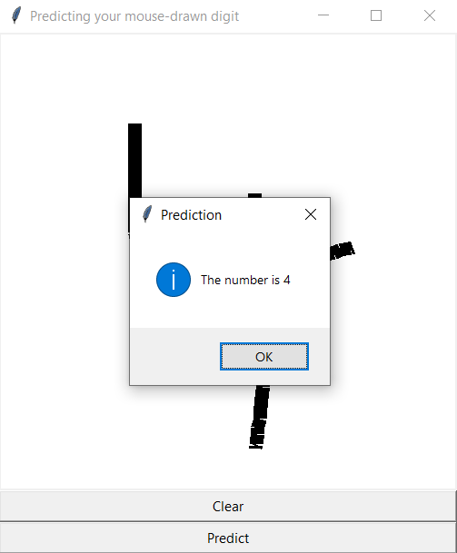

# Mouse-drawn digit recognizer
## Recognizing mouse-drawn digits with 5-layer Sequential CNN for digits recognition trained on MNIST dataset
_Gabriella Mansur_

The main steps in this project are:
* Load pre-trained CNN for digits recognition, trained on the MNIST dataset, with 99.7% accuracy (source: https://www.kaggle.com/yassineghouzam)
* Use as input/test image a mouse-drawn image with Tkinter (GUI programming)
* Pre-process the input image so it is in the correct format to feed it to model

Snapshots from app: 

